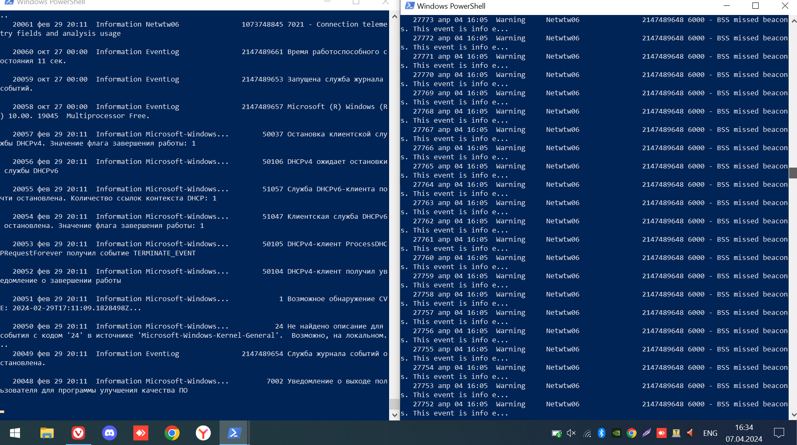
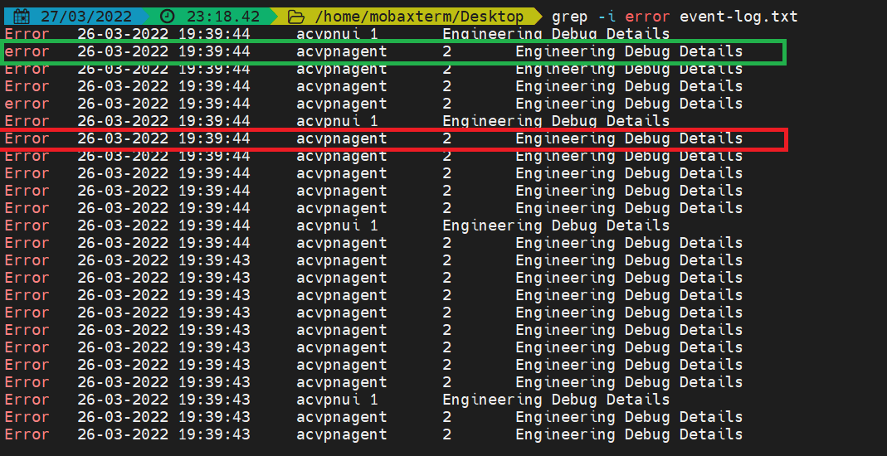
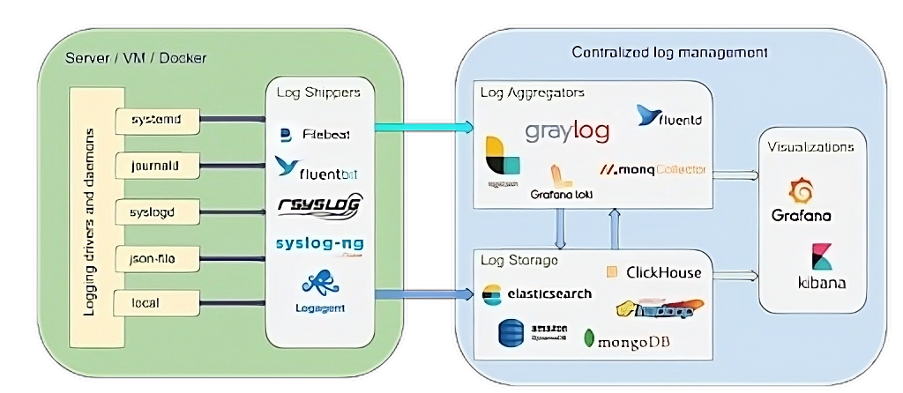
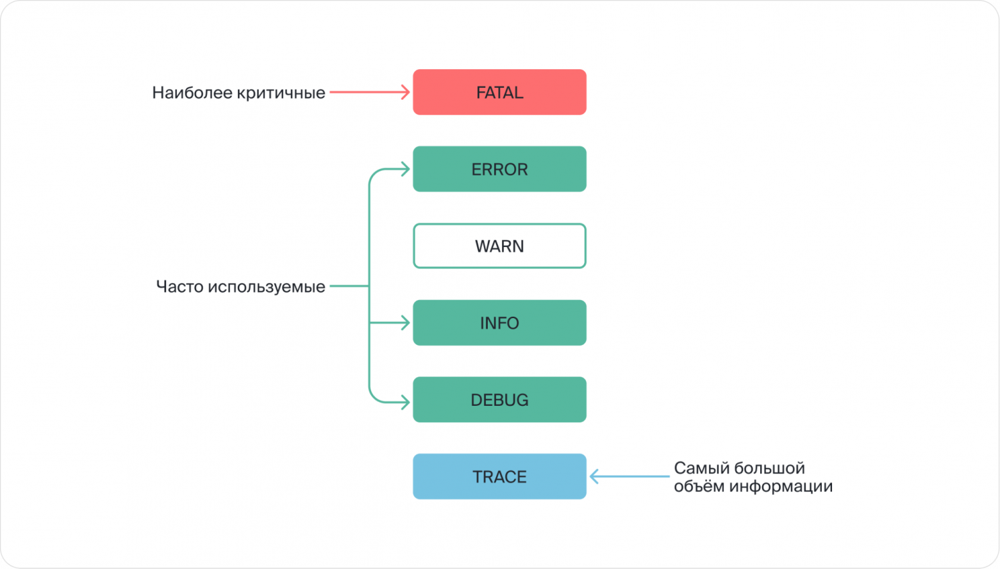
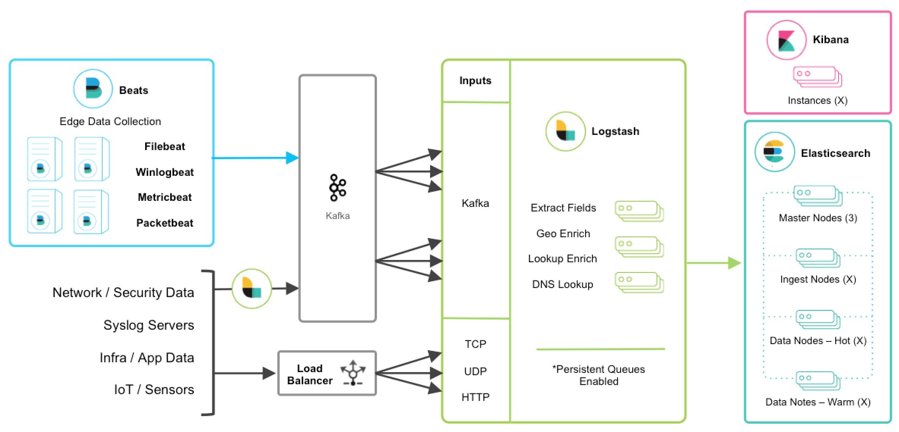

# 
 Полная каша

## 
 Intro 

По итогам прошлой лабы у нас есть работающее приложение. Во первых - **Возрадуемся**! Во вторых, давайте представим, что мы хотим обеспечить каку-никакую доступность этого приложения, перестанем хостить его на домашнем компьютере и перенесём в какой-нибудь датацентр. Казалось бы - всё прекрасно: мы защищены от отключения электричества и проблем с провайдером. Что вообще может пойти не так? 

Но когда что-то ломается, раньше мы просто открывали терминал и видели все ошибки (если видели), а теперь этот терминал где-то далеко так ещё и может быть вообще не доступен. А если пток пользователей возрастёт и мы начнём масштабировать наше приложение, то прийдётся открывать уже несколько терминалов c кучей строчек.

 

А если их будет штук 20? Как нам вообще понимать, где произошла ошибка и какая вообще ошибка произошла? Ответ на этот вопрос - **система логирования**.

Система логирования - это несколько сервисов, работающих параллельно с приложением, собирающих информацию о его работе и неработе.

В самом примитивном случае, мы можем просто писать информацию о работе приложения в файл и потом grep-ать от туда всё, что нам интересно. Это явно не спасёт нас от открытия 20-ти терминалов, но в общем случае все системы логирования работают именно так.

Т.е. - **структура** примерно такая:
  1. Есть некоторое приложение, которое пишет логи в определённом формате.
  2. Есть сущность, которая хранит эти логи.
  3. Есть сущность, которая их обрабатывает и предоставляет администратору.

С приложением - особо нет вопросов.

Хранить логи принято в БД временных рядов т.к. ~~неожиданно~~ в логах **всегда должен быть timestamp**, a TSDB как раз созданы, чтобы работать с данными такого формата. А чем смотреть - обычно зависит от того, где храним.

Но начнём не с э того, а с самих записей.

## 
 Типы логов

Мы конечно можем писать логи как хотим, но умные люди придумали стандартизацию этого процесса. 

Логи бывают разной степени важности и детализации. Чтобы упростить анализ логов, их принято разделять на несколько уровней:

  - Отладочные логи (Debug) - низкоуровневые сообщения о внутренних состояниях и переходах, полезны для отладки.

  - Информационные логи (Info) - общие сведения о работе приложения или системы.

   - Предупреждения (Warning) - нештатные или подозрительные ситуации, которые могут привести к ошибкам.

  - Ошибки (Error) - сообщения об ошибках в работе приложения. Требуют внимания.

  - Критические ошибки (Fatal) - критические сбои, которые приводят к неработоспособности системы.

  - Трассировка (Trace) - подробные пошаговые логи выполнения кода. Помогают найти причину ошибки.

Картинка из [вот этой статьи](https://habr.com/ru/companies/yandex_praktikum/articles/739058/) от яндекса. Там более развёрнуто описана классификация логов.

Так же логи делят на контексты или виды. Это помогает понять в какой части приложения произошла ошибка: перегрузилась память на сервере, произошла ошибка доступа к сервису или запроса к БД и.т.д.

Основная мысль - логи должны быть в удобном формате и содержать как можно меньше лишней информации т.к. их основная задача - помочь вам понять, что произошло и как это исправить в самый короткий временной промежуток. Плюс по этому - логи в одинаковом формате проще хранить и индексировать.

Если вы уже открыли логи - значит всё плохо и с этим надо что-то делать. 

А чтобы вы узнали что всё плохо не от начальства или службы поддержки, то нужно устанавливать систему оповещения на ошибки. Всегда приятнее говорить, что ваш отдел уже знает о проблеме и активноо её чинит, чем сидеть с довольным видом в час пиковой нагрузки и даже не подозревать, что система вот-вот упадёт, а потом заканомерно огребать. 

**Для любой внештатной ситуации надо настраивать alerting!** Система оповещений тоже должена быть простой и понятной.

Так чем же собирать, хранить и читать эти самые логи?

## 
 Стэки логирования

Как водится, если задача - типовая, то на рыкнке существует много её решений.

В гайде вы обзорно узнаете о двух стэках - ELK и Loki.

О других вариантах можно почитать [тут](https://habr.com/ru/articles/594805/) и [тут](https://habr.com/ru/companies/monq/articles/765130/). Там есть красивые картинки с кучей технологий, которые можно использовать. На большинство из них есть готовые step-by-step гайды, как запустить рабочий конфиг.

**ELK** - это ElasticSearch, Logstash и Kibana.
-

Если спросить у гугла, что такое ELK, то довольно быстро вы наткнётесть на такую картинку. Начну рассказывать про неё слева-направо.

- **Beats** - это легковесные агенты для сбора данных с различных источников и отправки их в Logstash или Elasticsearch.

    - Основные функции Beats:

      - Сбор данных в реальном времени из различных источников - логов, метрик, сетевого трафика и т.д.

      - Преобразование и обогащение данных. Beats может добавлять поля и метаданные к собираемым данным.

      - Отправка данных в Logstash для дальнейшей обработки или непосредственно в Elasticsearch для индексирования и хранения.

      - Мониторинг работы самого Beats агента.

    - Основные типы Beats:

      - Filebeat - сбор логов
      - Metricbeat - сбор метрик
      - Packetbeat - анализ сетевого трафика
      - Winlogbeat - сбор событий Windows
      - Heartbeat - мониторинг доступности сервисов
       
  - Beats позволяют легко масштабировать сбор данных за счет развертывания легковесных агентов на разных серверах. Данные из Beats затем централизованно обрабатываются в ELK стеке. Самих Beat-ов есть очень много, почти на любой вкус и цвет.

- **Другие источники данных**, помимо битов, которые отправляются в основной Logstash через API или кафку или любым другим методом.

- **Logstash** - это компонент, который отвечает за прием, обработку и фильтрацию данных перед их загрузкой в Elasticsearch.

    - Основные функции Logstash:

      - Прием данных из разных источников - файлов, баз данных, систем мониторинга, API и др. Для приема данных используются входные плагины.

      - Парсинг и нормализация данных из разных источников в единый формат для последующей обработки.

      - Фильтрация и обогащение данных с помощью различных правил. В Logstash есть большая библиотека фильтров для различных манипуляций с данными.

      - Отправка обработанных данных в выходные плагины. Чаще всего это Elasticsearch, но данные могут отправляться и в другие хранилища.

      - Агрегация данных из разных источников в единый поток для последующей обработки.

    - Logstash может таскать данные из самых разных источников: Файлы, Сеть, БД, Облачных сервисов, Брокеров очередей, Системных логов и.т.д. Но он - **stateless** т.е. данные он не хранит, а только преобразует для дальнейшего хранения. Как понятно, во многих случаях функционал битов можно заменить Logstash, но он атнють не легковесен и запускать очень много инстансов - крайне затратно.

    - На картинке есть ещё и **Kafka**. Она нужна не просто так. Дело в том, что ELK использует JVM => либо мы конфигурируем его с большим запасом по мощностям, либо предусматриваем, что иногда самые загруженные компоненты будут задумываться, чистить мусор или вообще перезагружаться. Как раз для предотвращения потери данных и нужна Kafka. (**Обзац глаголит истину только для действительно серьёзной нагрузки**)

- **Elasticsearch** - это хранилище данных.

  - Задачи ES - индексирование, хранение данных и поиск. Если кратко, то ES это круто. 
  
  - Основные фишки:
    -  Быстрый полнотекстовый поиск.
    -  Распределённое хранение данных.
    -  Отличная масштабируемость (которая необходима т.к. ресурсов ES нужно немало). Часто под ES выделяют отдельный кластер.

  - Есть [хорошая статья](https://habr.com/ru/articles/489924/), в которой довольно подробно рассказывают про то что это глобально такое, а в комментах пишут про альтернативы (тоже советую глянуть). 

- **Kibana** - инструмент для визуализации и анализа данных.

    - Основные возможности Kibana:

      - Визуализация данных из Elasticsearch с помощью разнообразных диаграмм, графиков и карт. Kibana позволяет создавать линейные, столбчатые, круговые диаграммы, карты и другие визуализации.

      - Создание интерактивных дашбордов. Дашборды позволяют комбинировать разные визуализации данных на одном экране и взаимодействовать с ними.

      - Построение отчетов и фильтрация данных. В Kibana можно создавать отчеты и фильтровать данные по различным критериям.

      - Мониторинг Elasticsearch в режиме реального времени. Kibana отображает статистику и метрики работы кластера Elasticsearch.

      - Управление индексами и данными в Elasticsearch. Из Kibana можно управлять индексами, документами, шардами и репликами.

      - Поддержка плагинов для расширения функциональности.

      - Веб-интерфейс и интеграция с Elasticsearch через REST API.
  
    - Когоче говоря - удобный интерфейс для взаимодействия с ES.

**Loki**
-

Мораль примерно та-же, что и в ELK, но Loki находится в экосистеме Grafana.

Продукт довольно молодой, так что красивой картинки не будет, но постараюсь так же доступно объяснить на словах.

В этосистеме Grafana есть аналоги для всех компонентов ELK стэка:
- **Exporters** - для сбора данных из различных источников. (Аналог Beast)
- **Promtail** - агент для сбора и преобразования логов. (Аналог Logstash)
- **Loki** - система централизованного хранения и поиска логов. (Аналог Elasticsearch)
- **Grafana** - инструмент для визуализации данных и построения дашбордов. (Аналог Kibana)

Есть [вот такая статейка](https://habr.com/ru/companies/badoo/articles/507718/), посвящённая сравнению ELK с Loki.

**Кратко по различиям**:

  - OpenSource.

  - Go вместо Java.

  - Loki быстрее пишет и сильнее сжимает данные, но уступает в возможностях чтения (нет полнотекста + ищет медленнее).
  
  - Масштабировать систему на Loki проще, чем на ELK. Да и Loki сам по себе - многокомпонентное решение, каждый компонент которого можно масштабировать.
  
  - Экосистема графана богата плагинами, готовыми дэшбордами, экспортёрами и алертингом. В силу открытости их даже больше, чем для ELK.

**Если совсем кратко**: ELK - закрыто, функциональнее, сложнее и аппаратно тяжелее. Loki - открыто, проще в остальных областях.

## 
 Суть работы

Как водится - первым делом нужно обоснованно выбрать стэк. И внести свой выбор и обоснование в [гугл таблицу для утверждения](https://docs.google.com/spreadsheets/d/1ZQlkPw7cNIPBLTRwwW5avy3ez7w2EJ4MSgLWcVd3s_Q/edit?usp=sharing) **до 14 апреля**.

После этого дело останется за малым - интегрировать систему логов в приложение из первой лабы. Минимальные требования написаны в файле задания лабы. Перед придумыванием и увернным агрументированием тех метрик, которые вы будете собирать, рекомендую прочесть [вот эту штуку от яндекса](https://habr.com/ru/companies/yandex/articles/530348/). Там по шагам внедряют технологии и объясняют что они дают с точки зрения мониторинга.

При тестировании системы нужно будет продемонстрировать логи по каждой из категорий. Аналитику по INFO логам составить проблем нет, но вот логи об ошибках (будь то WARN, ERR или FATAL) нужно будет отдельно получить. Скажем, отключив какой-то из компанентов приложения, добавив искуственную задерку (эмулируя перегруженность внешнего сервиса) или ограничив CPU и MEM использование на контейнеры с ними.