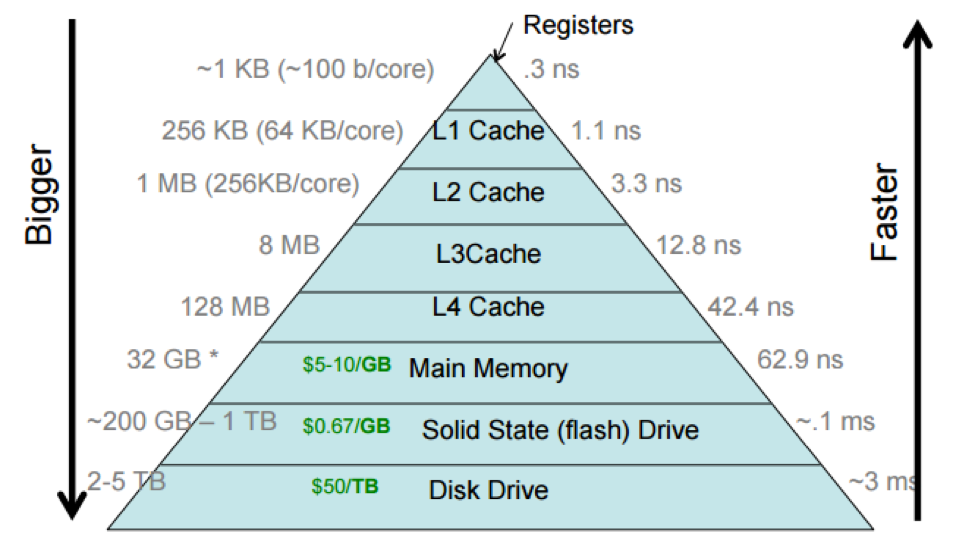
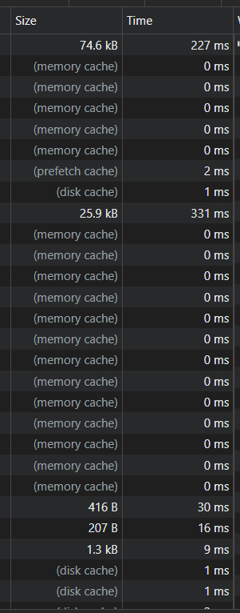

# 
 Узнаём, забываем, узнаём...

## 
 Intro 

В этот раз постараюсь быть краток, ибо семестр подходит к концу, читать много не охота.

Есть вот такая картинка, на которой отмечены примерные задержки доступа к произвольной ячейке памяти на разных уровнях. Чем память ближе к процессору, тем она быстрее и тем дороже.

Очевидно, когда данных много, мы хотим их хранить максимально дёшево => на жёстких дисках (дешевле конечно на магнитной ленте, но вроде так сейчас делает только IBM). Оказывается, что для нашего приложения пропускной способности дисков не хватает. Какие есть варинты.

Ну можно купить ещё дисков сделать RAID. Можно перейти на твердотельные накопители. Можно балансировать нагрузку между разными хранилищами. Но всё это стоит много денег. 

Зачастую, запросы от большого числа пользователей обладают некоторым единообразием, а часть запросов вообще оказывается идентична.

За примерами далеко ходить не надо: 

Это виджет на странице ya.ru, который показывает погоду, курсы валют и состояние пробок в вашем регионе. RPS этой веб странички достатачно большой, виджет видят все пользователи, актуальность с точьностью до секунды не требуется. 

Это - идеальный вариант для кеширования. Один раз в n времени выполняется полноценный запрос к бэку с рассчётом состояния пробок, обновлением курса валют и т.д. Результат его выполнения кешируется и возвращается клиенту. Все остальные клиенты быстро получают результат из кэша.

Что такое **кэширование**? Это механизм временного хранения данных для ускорения доступа к ним. Т.е. когда мы храним часто используемые данные "ближе" к потребителю. 

Кеши применяются фактически на всех уровнях работы компьютера:
  1. Процессорный кеш L1, L2, L3. В него загружаются инструкции и данные для выполения процессором.
  2. Кэш OC. Он находится в оперативной памяти. Здесь храняться часто используемые файлы и данные с диска, страницы памяти процессов, сетевые запросы, и т.д.
  3. Кэш приложения, который может быть как в ОЗУ, так и в ПЗУ. Скажем кэш вашего браузера. Да и сами базы данных нативно кешируюут частые запросы.

Возвращаясь к практике. Есть 2 варианта: кэширование на стороне сервера и кеширование на стороне клиента. Нам, как людям экономным, конечно хочется кешировать максимум на стороне клиента (т.е. на стороне браузера). Во 1 - память клиента нам тратить не жалко. Во 2 - меньше запросов к нам - больше сэкономлено на мощности сервера.

Яндекс так и делает: 

Но всё кешировать у клиента - нельзя т.к. сложно следить за актуальностью данных. Иногда приходится кешировать на строне сервера. Об этом и будет эта лабораторная.

## 
 Что и как кешировать

Тема популярная. На эту тему уже написана не одна сотня статей, так что не вижу смысла повторяться. [Раз](https://habr.com/ru/companies/zerotech/articles/316316/), [два](https://habr.com/ru/articles/168725/), [три](https://habr.com/ru/companies/oleg-bunin/articles/316652/).

Там приведены примеры того, что можно и нужно кешировать, примеры систем кеширования. А в последней статье отдельно советую почитать блок с ответами на вопросы. Ещё неплохо бы почитать коменты, там не так много бреда, как могло бы быть.

## 
 Суть работы

Как водится - первым делом нужно обоснованно выбрать стэк. И внести свой выбор и обоснование в [гугл таблицу для утверждения](https://docs.google.com/spreadsheets/d/1ZQlkPw7cNIPBLTRwwW5avy3ez7w2EJ4MSgLWcVd3s_Q/edit?usp=sharing).

Из систем можно рассмотреть Redis, Memcached, Hazelcast, Ehcache, Aerospike, Couchbase, Infinispan, NCache, и т.д.

В отчёте обязательно надо отразить изменение времени ответа на запросы и объяснить, почему так вышло.